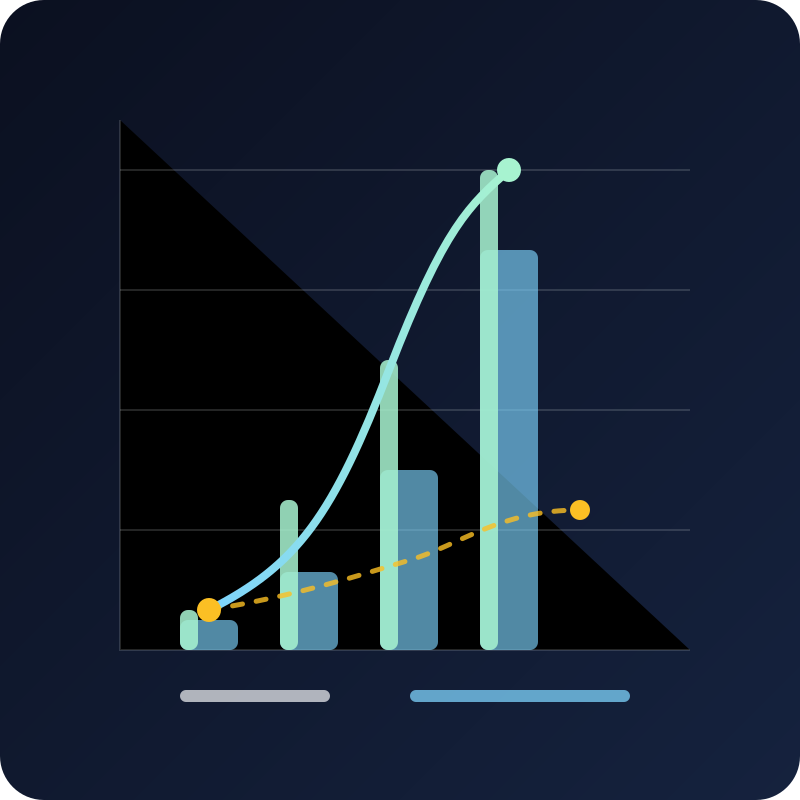

# Inference Recommendation Engine

> When a cheap inference route is only barely available, the lowest number is not the decision. This local, provider-neutral engine turns price ladders, supply, runtime evidence, and editable policy into a recommendation you can inspect and reproduce.

<p align="center">
  
</p>

## Why this exists

You have a model list, several providers, a handful of discounts, and a price ladder that looks like a bargain. Then the first real task arrives: the cheapest ask has one available route, the next ask has hundreds, and the “best price” turns out to be the least dependable option.

That choice is easy to get wrong when a dashboard collapses everything into one lowest-price field. You need to see **which price is actually well supplied**, how much runtime evidence exists, how recent the model is, and which policy decision caused one route to outrank another.

Inference Recommendation Engine exists to make that trade-off explicit. It is a small local core for developers and agent builders who want a recommendation they can adjust, test, and explain instead of inheriting an opaque vendor preference.

## What this project is

This is a **provider-neutral ranking package**. An adapter supplies normalized routes, price ladders, provider breadth, runtime observations, benchmark fields, and release information. The engine returns deterministic scores, evidence status, and gate reasons for a fixed candidate pool and policy.

It is for:

- developers comparing several inference routes for a real workload;
- agent builders choosing a current, affordable, well-supplied model;
- maintainers who need policy weights to be visible and versioned;
- teams that want property-driven and metamorphic checks around ranking behavior.

It is not a hosted router, a credential store, a provider catalog, or a guarantee that the first-ranked route will complete. Availability counts describe observed supply or redundancy; they do not prove concurrency, success rate, timeout rate, or latency.

## What you can make or use

| Output | What it helps you decide |
| --- | --- |
| Deterministic route ranking | Which candidate wins under the current policy |
| Supply-weighted effective price | Whether a low ask is meaningful at its observed availability |
| Near-free price regime | When price differences have saturated and availability/reliability should separate candidates |
| Runtime evidence and gates | Whether a route is measured, provisional, or not ready for use |
| Adapter boundary | How to connect local catalogs, rolling observations, or temporal source records without putting credentials in the package |
| Executable invariants | Whether a policy change preserves the behavior you intended |

The public package includes a generic price-supply API:

- `buildPriceSupplyPool` builds the empirical availability reference;
- `weightPriceLadder` preserves every raw point while calculating supply-weighted price;
- `evaluatePriceSupply` returns effective input/output cost and price regime;
- `rankPriceSupplyCandidates` produces a deterministic price-supply ranking.

## How it works

The reader-sized version is five steps:

1. **Bring your own evidence.** An adapter maps each route into explicit price, provider, runtime, and model fields.
2. **Keep the whole ladder.** A price point is represented as `[price per million, available count]`, not just the minimum ask.
3. **Compare supply empirically.** Availability is transformed with `log1p`, compared with the candidate pool, and adjusted for the local supply increase obtained per price increase.
4. **Saturate the low-cost band.** The default `0.0x` band, through `$0.10 / 1M`, receives near-free treatment. Price still matters below that boundary, but it stops overpowering supply, recency, strength, and measured reliability.
5. **Return an inspectable decision.** Rankings carry the policy version, raw and effective price signals, evidence state, and gate reasons.

<p align="center">
  
</p>

The important distinction is that a cheap outlier remains visible, but a strongly supplied higher ask can move the effective price toward the option you can actually use. Every raw point remains available for audit.

## Evidence and boundaries

The repository separates what is shipped from what an adapter must provide:

| Claim | Evidence | Status | Boundary |
| --- | --- | --- | --- |
| Empirical price-supply weighting is exposed publicly | [`src/supply.mjs`](src/supply.mjs), [`src/index.mjs`](src/index.mjs) | shipped | The package does not collect provider records |
| The full `0.0x` band can saturate price utility | [`spec/PRICE-SUPPLY-WEIGHTING.md`](spec/PRICE-SUPPLY-WEIGHTING.md), [`tests/supply.test.mjs`](tests/supply.test.mjs) | shipped | The boundary is policy, not a universal economic truth |
| A strongly supplied higher ask can move effective cost upward | [`tests/supply.test.mjs`](tests/supply.test.mjs) | experimentally_supported | Synthetic tests do not prove any provider's live behavior |
| Runtime reliability uses explicit observations and lower-confidence bounds | [`src/metrics.mjs`](src/metrics.mjs), [`spec/INVARIANTS.md`](spec/INVARIANTS.md) | shipped | Adapters own collection, windows, and source quality |
| A source adapter can add recency, benchmark, or provider fields | [`PROJECT.md`](PROJECT.md), [`README.md`](README.md) | planned at adapter level | This public core does not invent those fields |

The score is a policy result, not an objective intelligence label. Model-assisted judgments, vendor marketing, and missing measurements cannot silently become proof.

## Image generation and use

The README visuals are intentionally simple, text-free SVGs rather than provider screenshots or generated claims. The hero shows noisy route signals becoming an inspectable path. The supporting visual shows why a sparse cheap ask and a well-supplied higher ask contribute differently.

Their roles, exact alt text, dimensions, crop behavior, rejection conditions, and review decisions are recorded in [`.content-system/asset-manifest.json`](.content-system/asset-manifest.json) and [`.content-system/visual-style.json`](.content-system/visual-style.json). No external image service or credential is needed to reuse them.

For future visual changes, follow the pinned helper's [`docs/IMAGE_GUIDE.md`](https://github.com/Pukujan/content-generation-modules/blob/8532e3aecc30c4cfd8fbc2f95d472967a49ea2c7/docs/IMAGE_GUIDE.md). Keep diagrams text-free, preserve the main subject at narrow widths, and reject visuals that imply live guarantees.

## Templates and guides

Start with the target adapter in [`.content-system/`](.content-system/) and the public contract in [`spec/`](spec/):

- [`spec/INVARIANTS.md`](spec/INVARIANTS.md) — executable design relationships;
- [`spec/PRICE-SUPPLY-WEIGHTING.md`](spec/PRICE-SUPPLY-WEIGHTING.md) — ladder weighting and asymmetric price regime;
- [`policy.example.json`](policy.example.json) — editable policy example;
- [`examples/routes.json`](examples/routes.json) — synthetic route input;
- [`tests/`](tests/) — invariant, property, and metamorphic coverage.

The human-facing workflow is pinned to [the README playbook](https://github.com/Pukujan/content-generation-modules/blob/8532e3aecc30c4cfd8fbc2f95d472967a49ea2c7/docs/README_PLAYBOOK.md), [the image guide](https://github.com/Pukujan/content-generation-modules/blob/8532e3aecc30c4cfd8fbc2f95d472967a49ea2c7/docs/IMAGE_GUIDE.md), [the prior-work record](https://github.com/Pukujan/content-generation-modules/blob/8532e3aecc30c4cfd8fbc2f95d472967a49ea2c7/docs/PRIOR_WORK.md), [the migration guide](https://github.com/Pukujan/content-generation-modules/blob/8532e3aecc30c4cfd8fbc2f95d472967a49ea2c7/docs/MIGRATING_TO_0.2.md), and [the README template](https://github.com/Pukujan/content-generation-modules/blob/8532e3aecc30c4cfd8fbc2f95d472967a49ea2c7/templates/README.template.md).

## Prior work and references

The ranking contract carries forward the repository's earlier research on reliability signals, percentiles, instrumentation, redundancy, and property testing in [`RESEARCH-BASIS.md`](RESEARCH-BASIS.md). The public engine is intentionally smaller than a hosted router so that adapters can add their own source and temporal rules without changing the core.

The README story and visual contract are pinned to [Content Generation Modules](https://github.com/Pukujan/content-generation-modules/tree/8532e3aecc30c4cfd8fbc2f95d472967a49ea2c7), version `0.2.0`, commit `8532e3aecc30c4cfd8fbc2f95d472967a49ea2c7`. The target adapter records that pin so future agents do not silently read a moving branch.

## Try it

Requires Node.js 20 or newer.

```bash
npm install
npm test
npm run check:public
npm run demo
```

To use the package:

```js
import { rankPriceSupplyCandidates } from 'inference-recommendation-engine';

const ranked = rankPriceSupplyCandidates([
  {
    id: 'route-a',
    price: {
      inputLadder: [[0.01, 4], [0.09, 500]],
      outputLadder: [[0.04, 4], [0.36, 500]]
    }
  }
], { nearFreeCostCapPerMillion: 0.1 });

console.log(ranked[0].effectiveCost, ranked[0].utility);
```

For the complete route scorer, import `prepareCandidate` and `rankCandidates` from [`src/index.mjs`](src/index.mjs). For a portable package install:

```bash
npm install github:Pukujan/inference-recommendation-engine
npm pack
```

The smallest useful next step is to write one adapter that maps your route catalog and runtime observations into the public shape, then run the property suite before tuning policy weights.
